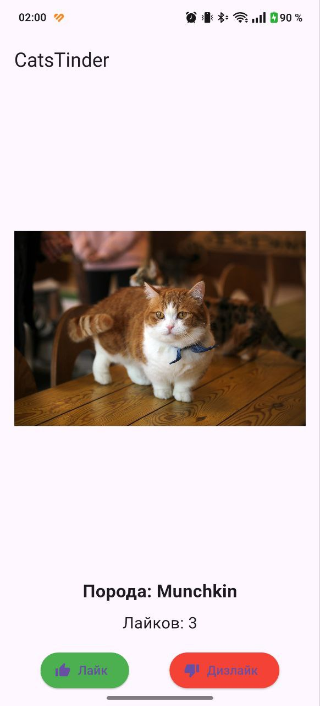
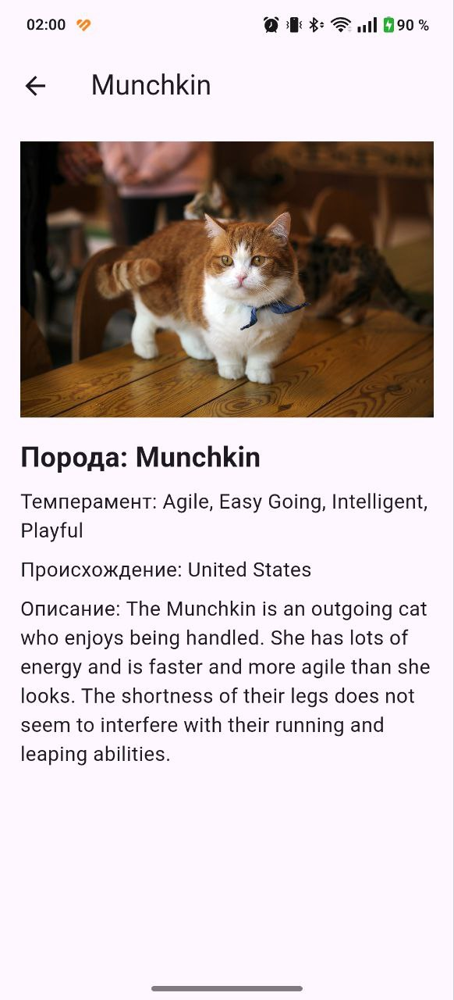
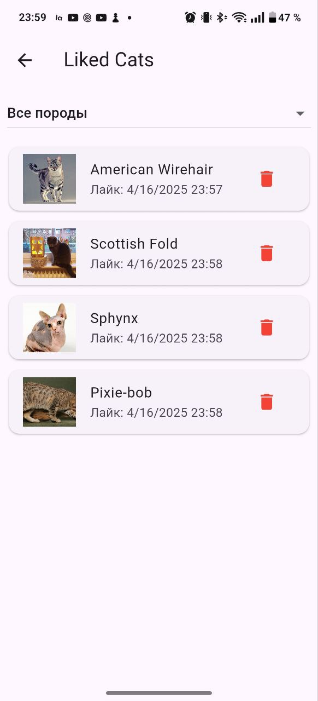
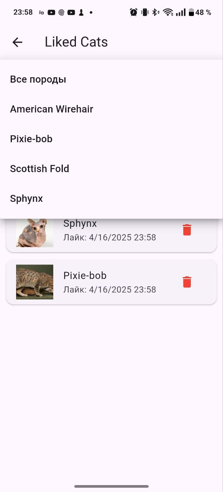
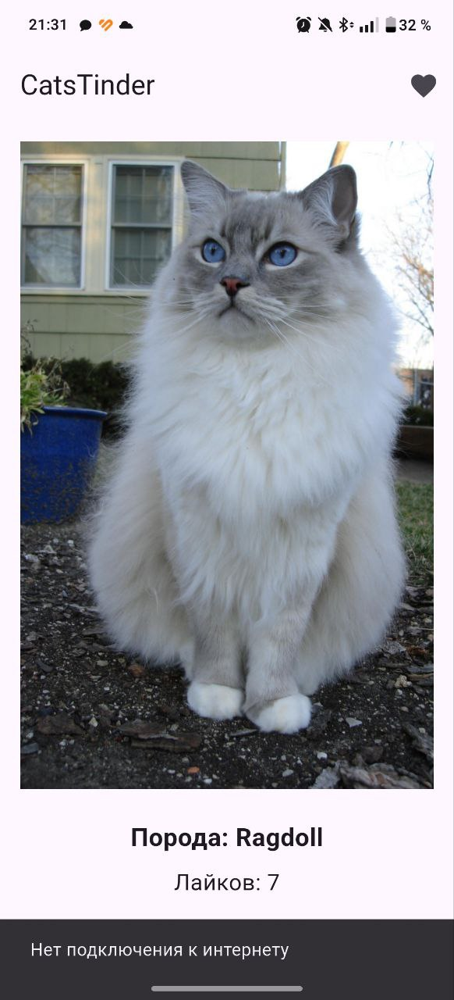

# Cats Tinder

**Описание проекта:**  
Данное приложение отображает случайное изображение котика с информацией о породе, полученное через API [thecatapi.com](https://thecatapi.com). Пользователь может свайпать изображение влево или вправо или использовать кнопки "Лайк" и "Дизлайк". При лайке увеличивается счетчик, а по нажатию на изображение открывается детальный экран с полной информацией о породе. Пользователь просматривать лайкнутых котиков в отдельном списке, фильтровать по породе, видеть время добавления и удалять из лайков.

**Реализованные фичи:**
- Отображение случайного изображения котика с названием породы.
- Свайп (влево – дизлайк, вправо – лайк) для смены котика.
- Две отдельные кнопки: Лайк и Дизлайк.
- Увеличение счетчика лайков при свайпе вправо или нажатии на кнопку "Лайк".
- Переход на детальный экран по нажатию на изображение, где отображается детальная информация о породе.
- Получение данных с использованием [TheCatAPI](https://thecatapi.com) через endpoint `/search` с параметром `has_breeds=1`.
- Использование виджета `CachedNetworkImage` для загрузки изображений.
- Использование `Navigator` для перехода между экранами.
- Применение виджетов `Row` и `Column`.
- Использование `StatefulWidget` для главного экрана и `StatelessWidget` для кнопок.
- Обработка ошибок сети через `AlertDialog`.
- Отображение прогресс бара при загрузке данных и изображений (`CircularProgressIndicator`).
- Экран со всеми лайкнутыми котиками (в рантайме).
- Для каждого котика отображаются изображение, порода и дата лайка.
- Удаление котика из списка свайпом влево или кнопкой мусорки.
- Фильтрация списка лайков по породе.
- При выборе породы список обновляется мгновенно.
- При удалении всех котов выбранной породы фильтр автоматически сбрасывается на "Все породы".
- Используется архитектура с разделением на слои: `Data`, `Domain`, `Presentation`.
- Управление состоянием реализовано через `Cubit`.
- Внедрение зависимостей через `get_it`.
- **Ссылка для скачивания APK:**  
[Скачать APK](app-release_true.apk) 

**Скриншоты интерфейса приложения:**  
  

